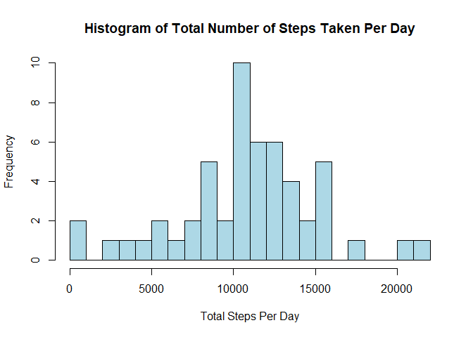
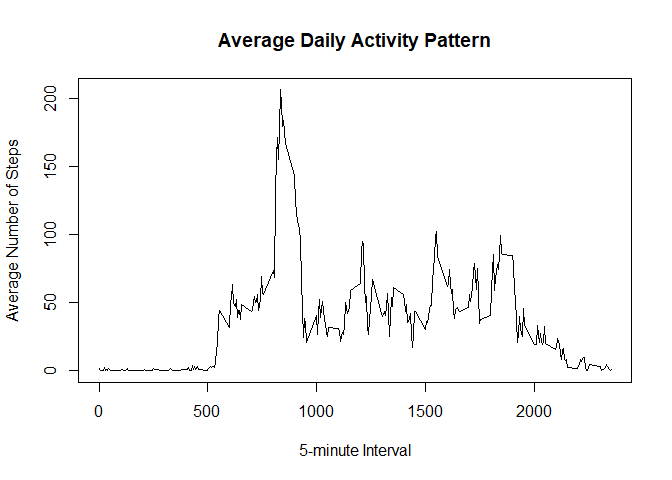
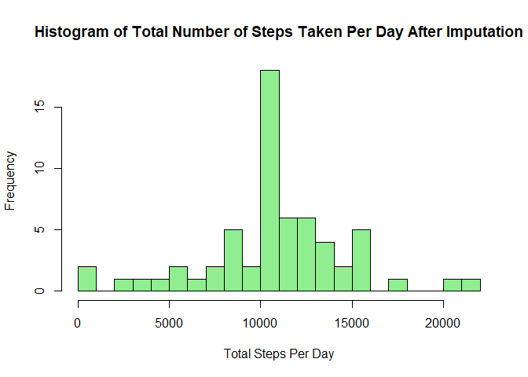
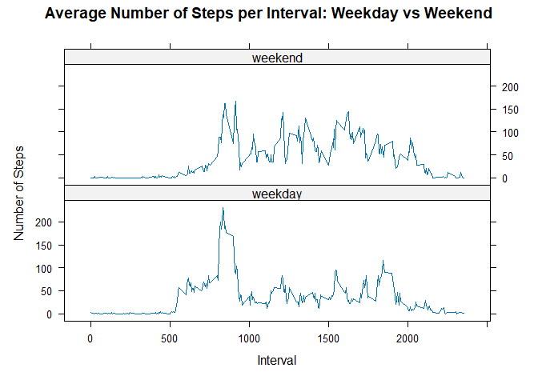

## Loading and preprocessing the data


``` r
data <- read.csv("activity.csv")

data$date <- as.Date(data$date)

str(data)
```

```
## 'data.frame':	17568 obs. of  3 variables:
##  $ steps   : int  NA NA NA NA NA NA NA NA NA NA ...
##  $ date    : Date, format: "2012-10-01" "2012-10-01" ...
##  $ interval: int  0 5 10 15 20 25 30 35 40 45 ...
```

``` r
summary(data)
```

```
##      steps             date               interval     
##  Min.   :  0.00   Min.   :2012-10-01   Min.   :   0.0  
##  1st Qu.:  0.00   1st Qu.:2012-10-16   1st Qu.: 588.8  
##  Median :  0.00   Median :2012-10-31   Median :1177.5  
##  Mean   : 37.38   Mean   :2012-10-31   Mean   :1177.5  
##  3rd Qu.: 12.00   3rd Qu.:2012-11-15   3rd Qu.:1766.2  
##  Max.   :806.00   Max.   :2012-11-30   Max.   :2355.0  
##  NA's   :2304
```


## What is mean total number of steps taken per day?


``` r
steps_per_day <- aggregate(steps ~ date, data = data, sum, na.rm = TRUE)

head(steps_per_day)
```

```
##         date steps
## 1 2012-10-02   126
## 2 2012-10-03 11352
## 3 2012-10-04 12116
## 4 2012-10-05 13294
## 5 2012-10-06 15420
## 6 2012-10-07 11015
```


``` r
hist(steps_per_day$steps,
     breaks = 20,
     main = "Histogram of Total Number of Steps Taken Per Day",
     xlab = "Total Steps Per Day",
     col = "lightblue",
     border = "black")
```

<!-- -->


``` r
mean_steps_per_day <- mean(steps_per_day$steps)
median_steps_per_day <- median(steps_per_day$steps)

mean_steps_per_day
```

```
## [1] 10766.19
```

``` r
median_steps_per_day
```

```
## [1] 10765
```

The mean total number of steps taken per day is 1.0766189\times 10^{4} and the median is 10765.

## What is the average daily activity pattern?

``` r
avg_steps_interval <- aggregate(steps ~ interval, data = data, mean, na.rm = TRUE)

head(avg_steps_interval)
```

```
##   interval     steps
## 1        0 1.7169811
## 2        5 0.3396226
## 3       10 0.1320755
## 4       15 0.1509434
## 5       20 0.0754717
## 6       25 2.0943396
```

``` r
plot(avg_steps_interval$interval,
     avg_steps_interval$steps,
     type = "l",
     xlab = "5-minute Interval",
     ylab = "Average Number of Steps",
     main = "Average Daily Activity Pattern")
```

<!-- -->

``` r
max_interval <- avg_steps_interval[which.max(avg_steps_interval$steps), ]
max_interval
```

```
##     interval    steps
## 104      835 206.1698
```
The 5-minute interval with the maximum average number of steps is 835.

## Imputing missing values

``` r
total_missing <- sum(is.na(data$steps))
total_missing
```

```
## [1] 2304
```
The total number of missing values in the dataset is 2304.

``` r
interval_means <- aggregate(steps ~ interval, data = data, mean, na.rm = TRUE)

data_filled <- merge(data, interval_means, by = "interval", suffixes = c("", ".mean"))

data_filled$steps <- ifelse(is.na(data_filled$steps),
                            data_filled$steps.mean,
                            data_filled$steps)

data_filled <- data_filled[, c("steps", "date", "interval")]

head(data_filled)
```

```
##      steps       date interval
## 1 1.716981 2012-10-01        0
## 2 0.000000 2012-11-23        0
## 3 0.000000 2012-10-28        0
## 4 0.000000 2012-11-06        0
## 5 0.000000 2012-11-24        0
## 6 0.000000 2012-11-15        0
```

``` r
steps_per_day_filled <- aggregate(steps ~ date, data = data_filled, sum)

hist(steps_per_day_filled$steps,
     breaks = 20,
     main = "Histogram of Total Number of Steps Taken Per Day After Imputation",
     xlab = "Total Steps Per Day",
     col = "lightgreen",
     border = "black")
```

<!-- -->

``` r
mean_steps_filled <- mean(steps_per_day_filled$steps)
median_steps_filled <- median(steps_per_day_filled$steps)

mean_steps_filled
```

```
## [1] 10766.19
```

``` r
median_steps_filled
```

```
## [1] 10766.19
```
After imputing missing values, the mean total number of steps per day is 1.0766189\times 10^{4} and the median is 1.0766189\times 10^{4}.

## Are there differences in activity patterns between weekdays and weekends?

``` r
data_filled$date <- as.Date(data_filled$date)

data_filled$day_type <- ifelse(weekdays(data_filled$date) %in% c("Saturday", "Sunday"),
                               "weekend",
                               "weekday")

data_filled$day_type <- factor(data_filled$day_type)

head(data_filled)
```

```
##      steps       date interval day_type
## 1 1.716981 2012-10-01        0  weekday
## 2 0.000000 2012-11-23        0  weekday
## 3 0.000000 2012-10-28        0  weekend
## 4 0.000000 2012-11-06        0  weekday
## 5 0.000000 2012-11-24        0  weekend
## 6 0.000000 2012-11-15        0  weekday
```


``` r
avg_day_type <- aggregate(steps ~ interval + day_type, data = data_filled, mean)

head(avg_day_type)
```

```
##   interval day_type      steps
## 1        0  weekday 2.25115304
## 2        5  weekday 0.44528302
## 3       10  weekday 0.17316562
## 4       15  weekday 0.19790356
## 5       20  weekday 0.09895178
## 6       25  weekday 1.59035639
```


``` r
xyplot(steps ~ interval | day_type,
       data = avg_day_type,
       type = "l",
       layout = c(1, 2),
       xlab = "Interval",
       ylab = "Number of Steps",
       main = "Average Number of Steps per Interval: Weekday vs Weekend")
```

<!-- -->

